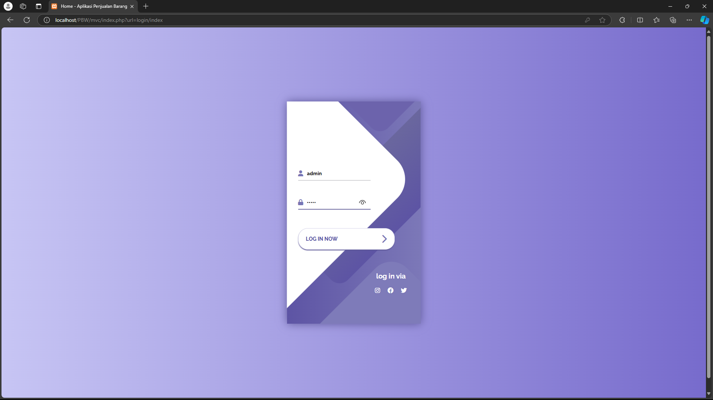

# Aplikasi Penjualan Barang

## Deskripsi

Aplikasi Penjualan Barang adalah sistem sederhana berbasis web yang digunakan untuk mengelola penjualan barang, mencakup fitur CRUD (Create, Read, Update, Delete) pada barang dan manajemen stok. Aplikasi ini dibangun menggunakan arsitektur **MVC (Model-View-Controller)** dan dilengkapi dengan fitur otentikasi menggunakan **session**.
### Fitur Aplikasi
- **Manajemen Stok**: Memantau dan mengelola stok barang secara real-time.
- **CRUD Barang**: Menambah, memperbarui, menghapus, dan melihat daftar barang.
- **Login dan Logout**: Sistem autentikasi sederhana dengan validasi username dan password.

## Teknologi yang Digunakan

- **PHP**: Sebagai bahasa pemrograman utama.
- **MySQL**: Database untuk menyimpan data barang.
- **MVC Pattern**: Arsitektur untuk memisahkan logika aplikasi.
- **CSS & HTML**: Untuk desain antarmuka pengguna.
- **Font Awesome**: Ikon untuk memperindah tampilan.

## Screenshot

### Halaman Home

### Form Login

### Halaman Admin

### Tambah Barang

### Edit Barang

### deleted Barang

## Kontribusi
Dibuat oleh Afandi Ikhsyan Al Karim (4522210032).

## Lisensi
Projek ini dilisensikan di bawah [MIT License](LICENSE).
