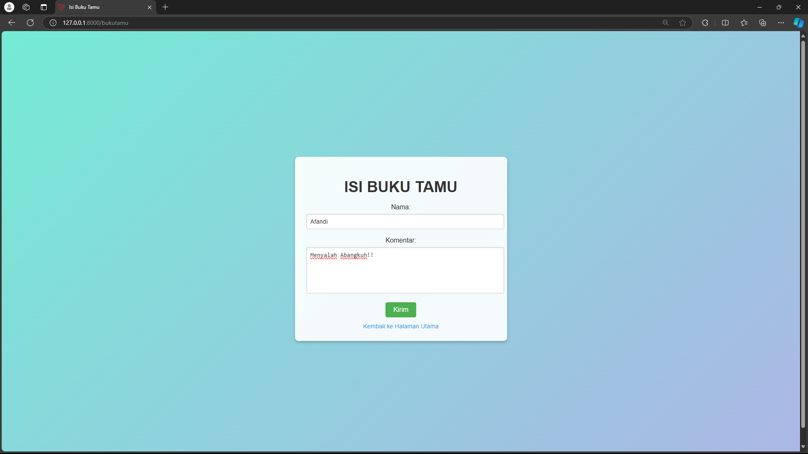
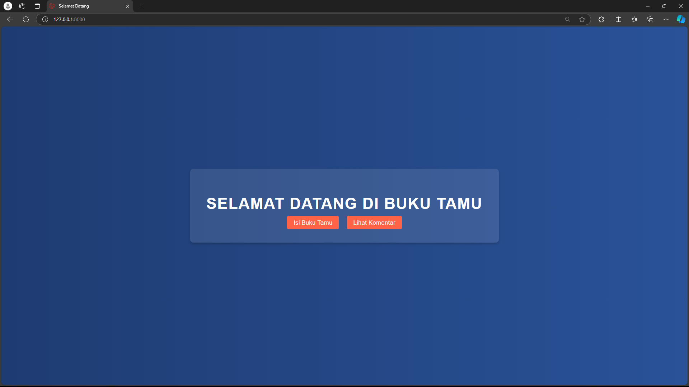
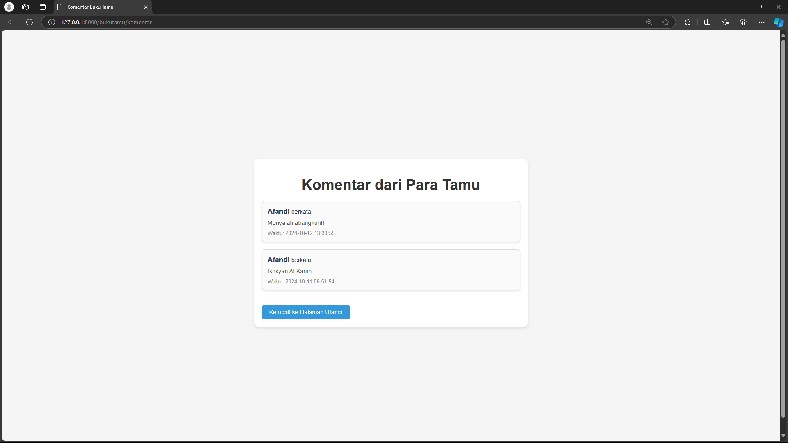

# Aplikasi Buku Tamu dengan Laravel

## Deskripsi
Aplikasi ini merupakan buku tamu sederhana yang dibangun menggunakan framework Laravel. Aplikasi ini memiliki beberapa fitur utama, seperti halaman untuk mengisi buku tamu, halaman untuk melihat komentar para tamu, dan koneksi ke database menggunakan MySQL.

## Spesifikasi Project
1. **Halaman landing**: Menampilkan pesan selamat datang dan tautan untuk mengisi buku tamu atau melihat komentar.
2. **Halaman isi komentar**: Formulir untuk pengunjung memasukkan nama dan komentar.
3. **Halaman melihat komentar**: Menampilkan komentar dari para pengunjung yang sudah diisi di buku tamu.
4. **Database**: Menggunakan MySQL dengan tabel `bukutamu` yang menyimpan `id`, `nama_pengunjung`, dan `komentar`.

## Prasyarat
Untuk menjalankan aplikasi ini, pastikan Anda telah memenuhi prasyarat berikut:
- PHP 8.2 / 8.3
- PHP Development Stack (Laragon, XAMPP, atau HERD + DBNGIN)
- MySQL Server
- Visual Studio Code dengan ekstensi MySQL Connection

## Instalasi
1. **Membuat database**: Jalankan perintah berikut di MySQL atau gunakan phpMyAdmin.
   ```sql
   CREATE DATABASE belajar_laravel CHARACTER SET utf8mb4 COLLATE utf8mb4_general_ci;
2. **Membuat project Laravel**: Buat project baru menggunakan perintah berikut.
   ```bash
   $ laravel new belajar-laravel
   # atau
   $ composer create-project laravel/laravel belajar-laravel
3. **Konfigurasi environment**: Edit file `.env` dengan menyesuaikan pengaturan database Anda.
   ```makefile
   DB_CONNECTION=mysql
   DB_HOST=127.0.0.1
   DB_PORT=3306
   DB_DATABASE=belajar_laravel
   DB_USERNAME=root
   DB_PASSWORD=rahasia
4. **Migrasi database**: Jalankan perintah migrasi untuk membuat tabel `bukutamu`.
   ```bash
   $ php artisan migrate
5. **Menjalankan server**: Jalankan aplikasi dengan perintah berikut.
   ```bash
   $ php artisan serve

## Fitur
- **Formulir Buku Tamu**: Pengguna dapat memasukkan nama dan komentar mereka.
- **Formulir Buku Tamu**: Menampilkan daftar komentar yang telah disimpan.

## Screenshot
Berikut adalah beberapa screenshot dari aplikasi:
1. **Halaman landing**:
2. **Formulir Buku Tamu**:
2. **Tampilan Komentar**:

## Kesimpulan dan Saran
Aplikasi ini telah berhasil dibangun dan berjalan dengan baik. Beberapa saran untuk pengembangan lebih lanjut:
1. **Validasi Input Lebih Lanjut**: Menambahkan validasi lebih detail pada formulir agar pengguna hanya dapat memasukkan data yang benar.
2. **Desain Antarmuka**: Pengembangan antarmuka agar lebih menarik dan responsif.
1. **Keamanan**: Menambahkan fitur keamanan seperti CSRF protection dan validasi server-side yang lebih ketat.

## Link Aplikasi


